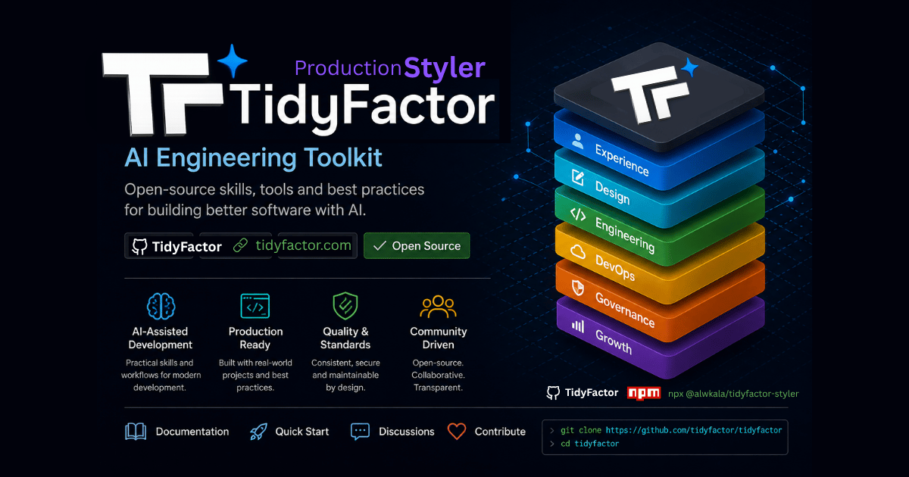
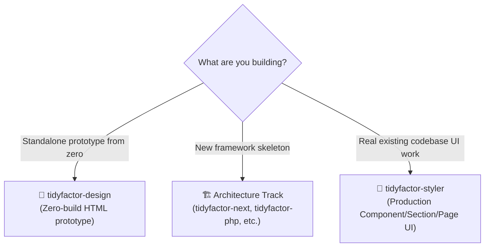
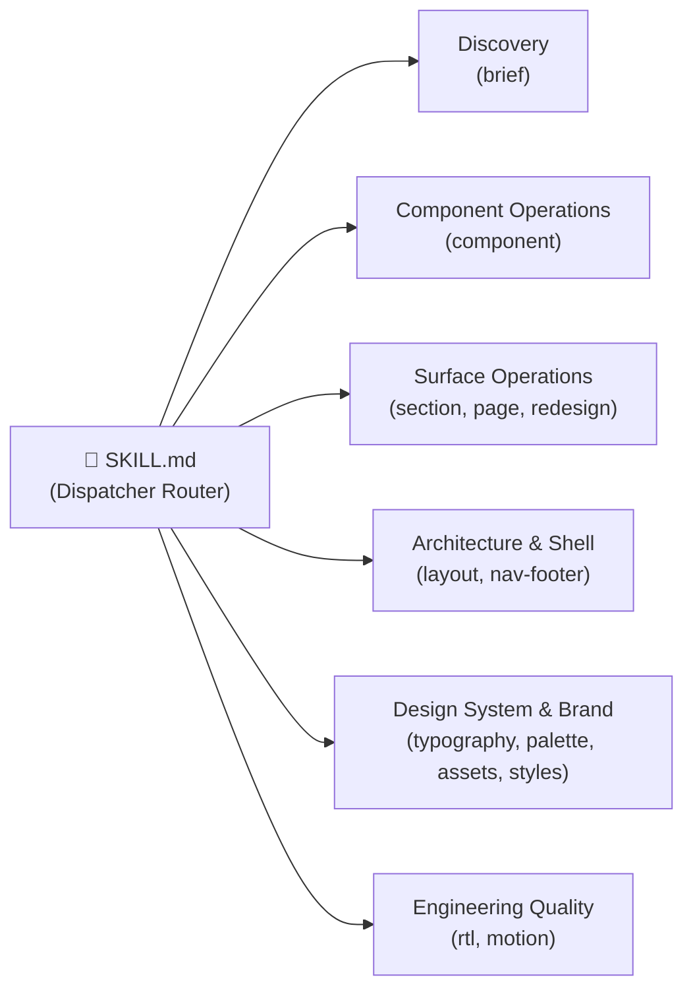
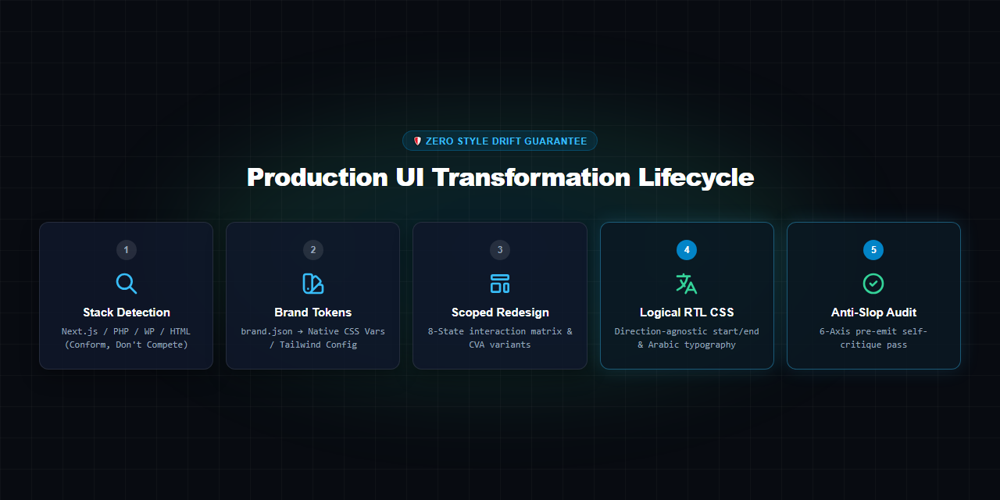

<div align="center">

# 🎨 TidyFactor Styler `v1.2.0`
### The Production Framework Styler, Surgical RTL Redesign & Anti-Slop UI Engine for AI Coding Agents

Give **Google Antigravity, Claude Code, Cursor, OpenAI Codex, or Windsurf** a production-grade UI transformation engine that operates directly inside your live codebase — without inventing duplicate style layers, alien dependencies, or per-page CSS drift.

[](https://www.npmjs.com/package/@alwkala/tidyfactor-styler)
[](LICENSE)
[](#-native-arabic--surgical-rtl-engineering)
[](#%EF%B8%8F-anti-slop-governance--quality-bar)
[-green.svg?style=for-the-badge)](#%EF%B8%8F-tidyfactor-skill-methodology--governance)

[ English ](README.md) • [ العربية ](README.ar.md) • [ فارسی ](README.fa.md) • [ Español ](README.es.md) • [ Português ](README.pt.md) • [ 简体中文 ](README.zh.md) • [ Deutsch ](README.de.md) • [ Français ](README.fr.md)

<br/><br/>

<p align="center">
  
</p>

</div>

---

## 📚 Table of Contents

- [🎯 Why TidyFactor/Styler](#-why-tidyfactorstyler)
- [🚀 Quick Start](#-quick-start)
- [🌟 Value Proposition: When to Use Styler?](#-value-proposition-when-to-use-styler)
- [⚡ 13-Stage Command Dispatcher Architecture](#-13-stage-command-dispatcher-architecture)
- [🛠️ The 8 Production Workflows](#%EF%B8%8F-the-8-production-workflows)
- [🌐 Supported Production Stacks](#-supported-production-stacks)
- [🇸🇦 Native Arabic & Surgical RTL Engineering](#-native-arabic--surgical-rtl-engineering)
- [🛡️ Anti-Slop Governance & Quality Bar](#%EF%B8%8F-anti-slop-governance--quality-bar)
  - [1. The 6-Axis Pre-Emit Self-Critique (P, H, E, S, R, V)](#1-the-6-axis-pre-emit-self-critique-p-h-e-s-r-v)
  - [2. The 8-State Component Interaction Matrix](#2-the-8-state-component-interaction-matrix)
- [❓ FAQ](#-faq)
- [🏛️ The TidyFactor Ecosystem](#%EF%B8%8F-the-tidyfactor-ecosystem)
- [🏛️ TidyFactor Skill Methodology & Governance](#%EF%B8%8F-tidyfactor-skill-methodology--governance)
- [🤝 Contributing](#-contributing)
- [👨‍💻 Support](#-support)
- [📜 License](#-license)

---

## 🎯 Why TidyFactor/Styler

Most AI UI prompts output generic HTML with inline styles, uncalibrated utility bloat, or alien libraries that clash with your existing repository. 

**TidyFactor/Styler enforces a strict "Conform, Don't Compete" engineering contract:** it detects your project's active framework, inspects existing design tokens, and outputs stack-native components that look like your senior frontend architect wrote them.

| Dimension | Generic AI Prompting / Prototypers | `tidyfactor-styler` |
|---|---|---|
| **Operating Environment** | Isolated demo files or new sandboxes | **Live, existing codebases** (React/Next.js, PHP, WordPress, HTML) |
| **Styling Conformance** | Injects new alien CSS rules or duplicate Tailwind layers | **Adopts your active Tailwind config**, CSS variables, or class conventions |
| **Scope Control** | Sloppy edits that accidentally break global layouts | **Strictly scoped refactoring** (component touches only component) |
| **Arabic & RTL Support** | Literal flipping or broken directional margins (`mr-*`, `left-*`) | **Native Logical CSS** (`ms-*`, `pe-*`, `start-*`) + letterform font scaling |
| **Anti-Slop Quality** | Generic purple AI gradients and missing interactive states | **6-Axis pre-emit self-critique** + mandatory 8-state interaction matrix |
| **Context Consumption** | Giant unorganized design dumps (10k+ tokens) | **Context-efficient dispatcher** (~350 tokens at start, loads on demand) |

---

## 🚀 Quick Start

### 1. Skill Injection via CLI

```bash
# Add Styler directly into your current project workspace
npx @alwkala/tidyfactor-styler add-skill
```

### 2. Workspace Installation per AI Agent

| AI Agent | Workspace Skill Path |
|---|---|
| **Google Antigravity** | `.agents/skills/tidyfactor-styler/` or global `~/.gemini/config/skills/` |
| **Claude Code** | `.claude-skill/skills/tidyfactor-styler/` |
| **Cursor / Codex / Windsurf** | `.agents/skills/tidyfactor-styler/` |

Once installed, simply invoke `/brief`, `/component`, `/section`, or `/redesign` inside your AI agent chat to begin surgical UI engineering!

---

## 🌟 Value Proposition: When to Use Styler?



| For Frontend Developers | For Fullstack & Agency Teams | For AI Coding Agents |
|---|---|---|
| **Conform, Don't Compete**: Adopts your existing naming, Tailwind config, and styling conventions without creating a parallel CSS system. | **Full Stack Agnostic**: Seamlessly switches between Next.js, PHP, WordPress, and Vanilla stacks with zero manual prompt calibration. | **Token-Efficient Dispatcher**: Lightweight `SKILL.md` entry router loads only ~350 tokens at launch, pulling memory only when required. |
| **Component-Scoped Precision**: Component redesigns touch only the component definition and its immediate usages — never neighboring widgets. | **Arabic / RTL First-Class**: Automated logical CSS properties (`ms-*`, `pe-*`, `start-*`), letterform-aware font scaling, and bidi isolation. | **Anti-Slop Certified**: 6-axis pre-emit self-critique (P, H, E, S, R, V) blocks generic AI purple gradients and sloppy styling tells. |
| **8-State Interaction Matrix**: Guarantees default, hover, active, focus, disabled, loading, empty, and error states for all components. | **Brand SSOT Integration**: Automatically reads `brand.json` and maps design tokens to native CSS custom properties or framework theme vars. | **Deterministic Checklists**: Every workflow terminates with an explicit, quantifiable validation checklist before shipping. |

---

## ⚡ 13-Stage Command Dispatcher Architecture

`tidyfactor-styler` exposes **13 precision slash commands** organized into a modular dispatch architecture:



| Command | User Intent | What It Loads | Output & Value |
|---|---|---|---|
| `brief` | "Establish design brief / project baseline" | `workflows/brief.md` + `memory/decision-points.md` | Pre-flight interview caching target framework and design school. |
| `component` | "Create / Redesign this component" | `workflows/component-create.md` or `component-redesign.md` + `component-anatomy.md` + `stacks/*.md` | Production React/PHP/HTML component with 8-state coverage & CVA variants. |
| `section` | "Create / Restyle this section" | `workflows/section-create.md` or `section-redesign.md` + `layout-archetypes.md` + `nav-footer-catalog.md` | Scoped section surface with responsive rhythm and clean visual hierarchy. |
| `page` | "Build a new production page" | `workflows/page-create.md` + `layout-archetypes.md` + `nav-footer-catalog.md` + `stacks/*.md` | Complete page assembly strictly adhering to framework file conventions. |
| `redesign` | "Redesign this existing page" | `workflows/page-redesign.md` + `layout-archetypes.md` + `nav-footer-catalog.md` + `quality-bar.md` | High-impact visual overhaul with zero functional regression or broken state. |
| `layout` | "Select layout archetype / macrostructure" | `memory/layout-archetypes.md` + `stacks/*.md` | Matches product context to 1 of 8 macrostructure archetypes (`editorial`, `interface`, etc.). |
| `nav-footer` | "Select navigation & footer archetypes" | `memory/nav-footer-catalog.md` + `typography-arabic.md` + `rtl-css-engineering.md` | Chooses from N1–N9 navigation and Ft1–Ft8 footer archetypes with RTL alignment. |
| `typography` | "Pick/pair typography, incl. Arabic" | `memory/typography-arabic.md` | Applies 7 mood-routed font pairings (Cairo, Tajawal, El Messiri, Inter, Outfit). |
| `palette` | "Extract color palette & WCAG AA contrast" | `memory/brand-tokens.md` + `memory/asset-tooling.md` | Generates semantic token scales with automated WCAG 2.1 AA contrast scores. |
| `assets` | "Asset hygiene & image optimization" | `memory/asset-tooling.md` + `memory/quality-bar.md` | Compresses images, inspects dimensions, and processes image assets. |
| `rtl` | "Audit & fix RTL / Arabic correctness" | `workflows/rtl-audit-fix.md` + `memory/rtl-css-engineering.md` | Converts directional CSS to logical properties and fixes icon flipping rules. |
| `motion` | "Add / review motion and interaction" | `memory/motion-principles.md` | Orchestrates Framer Motion / Alpine transitions with `prefers-reduced-motion` a11y. |
| `styles` | "Choose a design direction / style movement" | `memory/design-styles.md` | Directs UI to a specific aesthetic movement (Modern SaaS, Editorial, Swiss, etc.). |

---

## 🛠️ The 8 Production Workflows

Every task follows a strict, single-outcome workflow ending in an automated validation checklist:

1. **`brief.md`**: Pre-flight CDL Discovery $\rightarrow$ Framework Baseline Lock $\rightarrow$ Brand Token Mapping $\rightarrow$ `.tidyfactor/styler-brief.md` Cache.
2. **`component-create.md`**: Design Read $\rightarrow$ Variant & State Mapping $\rightarrow$ Stack-Native Implementation $\rightarrow$ Pre-Emit Critique $\rightarrow$ Verification.
3. **`component-redesign.md`**: Current State Audit $\rightarrow$ Intent & Direction Selection $\rightarrow$ Scoped Refactoring $\rightarrow$ Zero Regression Check.
4. **`section-create.md`**: Macrostructure Alignment $\rightarrow$ Layout Archetype Rhythm $\rightarrow$ Inner Component Composition $\rightarrow$ Responsive Polish.
5. **`section-redesign.md`**: Section Scope Isolation $\rightarrow$ Hierarchy Elevation $\rightarrow$ Visual Anchor Refresh $\rightarrow$ Mobile Grid Audit.
6. **`page-create.md`**: Page Archetype Blueprint $\rightarrow$ Nav/Footer Selection $\rightarrow$ Section Assembly $\rightarrow$ SEO & Metadata Injection.
7. **`page-redesign.md`**: Global Visual Cohesion $\rightarrow$ Conversion Path Optimization $\rightarrow$ Typography Harmony $\rightarrow$ Performance Budget.
8. **`rtl-audit-fix.md`**: Directional CSS Elimination $\rightarrow$ Logical Properties Refactor $\rightarrow$ Bi-directional Icon Inversion $\rightarrow$ Font Hierarchy Tuning.

---

## 🌐 Supported Production Stacks

`tidyfactor-styler` inspects your codebase and binds dynamically to your target stack's architecture:

| Target Framework | Styling Foundation | Component Architecture | Motion Engine |
|---|---|---|---|
| **React / Next.js** (App Router & Pages) | Tailwind CSS v4 / v3 or CSS Modules | Radix UI / shadcn/ui + CVA + `clsx` + `tailwind-merge` | Framer Motion (`framer-motion`) |
| **PHP (TidyFactor / Flight / Medoo)** | Tailwind CSS or Native CSS Custom Properties | Semantic HTML5 Partials (Plates / Blade / PHP Views) | Alpine.js (`x-transition`) or CSS Transitions |
| **WordPress / Classic CMS** | Modern Theme CSS / Gutenberg Styles | PHP Template Parts / Block Markup | Native CSS Keyframes / Vanilla JS |
| **Static HTML / CSS / JS** | Semantic CSS / Modern CSS Variables | Modular Component Blocks | Vanilla JS / CSS Transitions |

---

## 🇸🇦 Native Arabic & Surgical RTL Engineering

<p align="center">
  
</p>

### 1. Logical CSS Properties Enforcement
`tidyfactor-styler` eliminates legacy directional styles (`margin-left`, `float: right`, `left: 0`) in favor of modern logical CSS:

```css
/* Standard Logical Property Architecture */
.styler-card {
  margin-inline-start: 1.5rem;    /* Replaces margin-left / margin-right */
  padding-inline-end: 1.25rem;    /* Replaces padding-right / padding-left */
  inset-inline-start: 0;          /* Replaces left / right */
  text-align: start;              /* Replaces text-align: left */
  border-start-start-radius: 8px; /* Logical corner radius */
}
```

### 2. Letterform-Aware Arabic Typography
Arabic script requires specific line-height and letter-spacing compensation:
- **Never use negative `letter-spacing` (tracking)** on Arabic text (it breaks cursive glyph connections).
- **Increase `line-height` by +15–20%** compared to Latin typography to accommodate ascenders and descenders.
- **Mood-Routed Font Pairings**:
  - *Modern SaaS / Interface*: Cairo / Tajawal + Inter / Outfit
  - *Editorial / High-Trust B2B*: IBM Plex Arabic + IBM Plex Sans
  - *Luxury / Creative*: El Messiri (never below 24px) + Plus Jakarta Sans

---

## 🛡️ Anti-Slop Governance & Quality Bar

### 1. The 6-Axis Pre-Emit Self-Critique (P, H, E, S, R, V)

Before emitting code, the agent evaluates output against the **6-Axis Anti-Slop Rubric** (`memory/quality-bar.md`):

- **P — Palette Harmony (0–10)**: Strict WCAG 2.1 AA contrast; no generic AI purple/pink gradients without explicit brand mandate.
- **H — Hierarchy & Rhythm (0–10)**: Clear visual anchor; intentional whitespace sizing using a 4px/8px baseline grid.
- **E — Execution Fidelity (0–10)**: Full semantic HTML5; no empty `<div>` soup or misplaced wrappers.
- **S — State Completeness (0–10)**: All 8 component states implemented.
- **R — RTL Correctness (0–10)**: 100% logical CSS properties; proper icon inversion for directional arrows.
- **V — Variety & Distinction (0–10)**: Distinct design school character; zero default Bootstrap-like look.

### 2. The 8-State Component Interaction Matrix

Every interactive component must provide complete visual coverage for:
1. `default`: Baseline rest state with clear affordance.
2. `hover`: Subdued lift or contrast elevation (transition $\le 150\text{ms}$).
3. `active`: Pressed micro-scale ($0.98$) or inset depth.
4. `focus-visible`: 2px offset focus ring for keyboard accessibility.
5. `disabled`: Reduced opacity ($0.5$), `cursor: not-allowed`, pointer-events disabled.
6. `loading`: Skeleton loader or accessible spinner preventing layout shifts.
7. `empty`: Welcoming empty state illustration and actionable call to action.
8. `error`: Semantic danger state with accessible error description.

---

## ❓ FAQ

<details>
<summary><b>How is Styler different from <code>tidyfactor-design</code>?</b></summary>
<br/>
<code>tidyfactor-design</code> creates standalone, zero-build clickable HTML prototypes in a separate demo directory. <b><code>tidyfactor-styler</code> operates directly inside your real codebase</b> (Next.js, PHP, WordPress, HTML) modifying existing components and respecting your active CSS architecture.
</details>

<details>
<summary><b>Will Styler overwrite or mess up my existing Tailwind configuration?</b></summary>
<br/>
<b>Never.</b> Styler follows the "Conform, Don't Compete" rule: it inspects your <code>tailwind.config.js</code> or CSS files and uses your existing utility classes and token definitions.
</details>

<details>
<summary><b>Which AI coding agents are supported?</b></summary>
<br/>
<b>Google Antigravity, Claude Code, Cursor, OpenAI Codex, and Windsurf</b> are all supported with 100% behavioral parity.
</details>

<details>
<summary><b>How does Styler handle Arabic / RTL layouts?</b></summary>
<br/>
Styler uses CSS Logical Properties (e.g. <code>margin-inline-start</code>, <code>inset-inline-start</code>, <code>text-align: start</code>) and handles icon flipping, line-height expansion, and Arabic font pairing automatically.
</details>

---

## 🏛️ The TidyFactor Ecosystem

**TidyFactor** is a modular web architecture and AI coding agent skill ecosystem built on clear separation of concerns across the product lifecycle:

```
TidyFactor Organization (github.com/TidyFactor)
│
├── Design Skills
│   ├── Cinematic    → Experience / "Wow"     (Apple × Cartier Scroll-Driven Landing Pages)
│   ├── Design       → Prototype / "Build"    (Code-Native UI Design Engine & Figma Alternative)
│   └── Styler       → Production / "Ship"    (Framework Styler & RTL Polish Engine)
│
├── Development Skills
│   ├── HTML         → Content & Static       (Semantic SEO & Static Platform Starter)
│   ├── HTMX         → Hypermedia             (Server-Driven Micro-Interactions)
│   ├── JS           → Vanilla SPA            (Framework-Free Reactive ES Modules)
│   ├── PHP          → Server-Rendered        (Modern PHP 8.x Component UI & Architecture)
│   └── Next         → Multi-Tenant SaaS      (Next.js 16, React 19, Supabase RLS & Dev-Perf)
│
└── Growth Skills
    └── Marketing    → Growth / Revenue       (Direct Response, Pillar SEO & Content Lifecycles)
```

### 💎 Frontend Triad

```
                TidyFactor
                    │
          ┌─────────┼─────────┐
          │         │         │
      Cinematic   Design    Styler
          │         │         │
      Experience Prototype Production
          │         │         │
        "Wow"      "Build"   "Ship"
```

### 📦 Community Package & Skill Parity

| Track | Category | GitHub Repository | Agent Skill | NPM Package |
| :--- | :--- | :--- | :--- | :--- |
| **Styler** | Design | [`TidyFactor/Styler`](https://github.com/TidyFactor/Styler) | `tidyfactor-styler` | [`@alwkala/tidyfactor-styler`](https://www.npmjs.com/package/@alwkala/tidyfactor-styler) |
| **Design** | Design | [`TidyFactor/Design`](https://github.com/TidyFactor/Design) | `tidyfactor-design` | [`@alwkala/tidyfactor-design`](https://www.npmjs.com/package/@alwkala/tidyfactor-design) |
| **Cinematic** | Design | [`TidyFactor/Cinematic`](https://github.com/TidyFactor/Cinematic) | `tidyfactor-cinematic` | [`@alwkala/create-cinematic-kit`](https://www.npmjs.com/package/@alwkala/create-cinematic-kit) |
| **Next** | Development | [`TidyFactor/Next`](https://github.com/TidyFactor/Next) | `tidyfactor-next` | [`@alwkala/tidyfactor-next`](https://www.npmjs.com/package/@alwkala/tidyfactor-next) |
| **HTML** | Development | [`TidyFactor/HTML`](https://github.com/TidyFactor/HTML) | `tidyfactor-html` | [`@alwkala/tidyfactor-html`](https://www.npmjs.com/package/@alwkala/tidyfactor-html) |
| **HTMX** | Development | [`TidyFactor/HTMX`](https://github.com/TidyFactor/HTMX) | `tidyfactor-htmx` | [`@alwkala/tidyfactor-htmx`](https://www.npmjs.com/package/@alwkala/tidyfactor-htmx) |
| **JS** | Development | [`TidyFactor/JS`](https://github.com/TidyFactor/JS) | `tidyfactor-js` | [`@alwkala/tidyfactor-js`](https://www.npmjs.com/package/@alwkala/tidyfactor-js) |
| **PHP** | Development | [`TidyFactor/PHP`](https://github.com/TidyFactor/PHP) | `tidyfactor-php` | [`@alwkala/tidyfactor-php`](https://www.npmjs.com/package/@alwkala/tidyfactor-php) |
| **Marketing** | Growth | [`TidyFactor/Marketing`](https://github.com/TidyFactor/Marketing) | `tidyfactor-marketing` | [`@alwkala/tidyfactor-marketing`](https://www.npmjs.com/package/@alwkala/tidyfactor-marketing) |

---

## 🏛️ TidyFactor Skill Methodology & Governance

`tidyfactor-styler` passes all **8 Architectural Governance Rules** under [`tidyfactor-skill-architect`](https://github.com/TidyFactor/Skill-Architect):

1. ✅ **Dispatcher Discipline**: `SKILL.md` routes commands without executing tasks (~350 tokens).
2. ✅ **One Workflow = One Outcome**: Every workflow has a single deliverable with an explicit validation checklist.
3. ✅ **Operational Memory**: Pure design patterns, token schemas, and typography rules—zero narrative prose.
4. ✅ **No Empty Structures**: Clean, flattened architecture without single-file folders.
5. ✅ **Philosophy Isolation**: Technical execution separated from marketing commentary.
6. ✅ **Trigger-Justified Growth**: Commands added per verifiable UI engineering lifecycle stages.
7. ✅ **Security & Quality Bar**: Automated pre-emit self-critique rubric and 8-state interaction matrices.
8. ✅ **Cross-Platform Parity**: 100% identical behavior across Antigravity, Claude Code, Cursor, and Codex.

---

## 🤝 Contributing

We welcome community contributions, custom stack adapters, and workflow refinements!

Please read our `CONTRIBUTING.md` and `CODE_OF_CONDUCT.md` before opening a Pull Request. All proposed workflows and memory extensions must satisfy the `tidyfactor-skill-architect` governance rules.

---

## 👨‍💻 Support

- 🌐 **Website:** [tidyfactor.com](https://tidyfactor.com/)
- 📚 **Documentation:** [tidyfactor.com/documentation](https://tidyfactor.com/documentation)
- 🤝 **Commercial Partner:** [Alwkala Digital Agency](https://alwkala.com/)
- 🐙 **GitHub Organization:** [github.com/TidyFactor](https://github.com/TidyFactor)
- 📧 **Inquiries:** [hello@tidyfactor.com](mailto:hello@tidyfactor.com)

---

## 📜 License

Licensed under the **Apache License 2.0**. Copyright (c) 2026 [TidyFactor](https://tidyfactor.com) & [Alwkala](https://alwkala.com).
